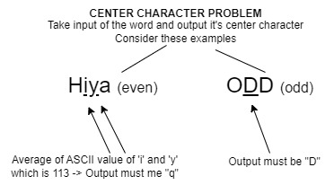

# CENTER CHARACTER  #

- **Arnab Mukherjee**
- **s2423463**
- **Group 05- Mon 1510-1630 (Intermediate)**
- **Brodbelt Alexander**
- **2023-02-15**
# Target audience #
This challenge is targeted for <u>complete beginners</u> who are quite new on their journey of programming. It encourages the implementation of a creative solution for a rather theoretically easy problem with an interesting approach with real-world applications to nurture the reader's curiosity


# Description of the Challenge #

The 'Finding the Centre' challenge requires us to find the centre of a given string of characters. These characters have an associated [ASCII](https://en.wikipedia.org/wiki/ASCII) value to them.

Take a look at this for a better idea with an example.



Given the input is of

- **Odd length**- we just return the character at the centre position.
- **Even length**- we must take the average of the ASCII values of the two centres.

The ASCII character of the average value must be returned which will be the centre character. Also, if the input is empty the output must also be empty.

This is what the premise of the challenge consists of.

Converting strings to its integer value has several use-cases. Some examples are-
- [Encryption](https://en.wikipedia.org/wiki/Encryption)
- [Data encoding](https://en.wikipedia.org/wiki/Character_encoding)
- [Electronic commiunication](https://en.wikipedia.org/wiki/Communications-electronics)

Learn more about the uses of the concept of converting strings to its integer value and ASCII [here](https://www.britannica.com/topic/code-communications).

# Original challenge question from codegolf #

[Short link to codegolf challenge](https://codegolf.stackexchange.com/questions/64599/find-the-center)

Given a string of ASCII characters, output the character that is in the middle. If there is no middle character (when the string has an even length), output the ASCII character whose ordinal is the floored average of the two center characters. If the string is empty, an empty string should be output.

# Let's start by making a design #

# Our design and diagram #


<u>**Description of design for Accessibility**</u> -

[The first design is a description of the thought process and the solution in words.
The two possibilites that arise are if the length of the word is either even or odd. The word if even would be averaged using the ASCII value and a new corresponding centre character will be produced. While on the other hand the length being odd, dividing it by 2 gives us a value in the form of a decimal and the floored value is taken. This gives us the position and the corresponding character is printed ](design02.jpg)

This is followed by 3 simple examples with expected result.

A very common real world use-case this design can be used for is [Encryption](https://en.wikipedia.org/wiki/Encryption), which also is an implementation of converting strings to an integer value and encoding it accordingly.

The diagram has been checked against color-blindess and partial sightedness simulators for accessibility. Above description can be transcribed to audio for a blind person for an understanding of the diagram.


# Here's the pseudo-code  #
Learn more about pseudo-code [here](https://www.geeksforgeeks.org/how-to-write-a-pseudo-code/)

```
define printCentreCharacter {
//define the main function


  input length = len
    
  if len is even 
       int c1 = char at len/2
       int c2 = char at (len/2)+1
       int c_avg = (c1+c2)/2
     
     
       char centre = (char) c_avg
       //convert value of c_avg to char
     print (centre)
     
  else if len is odd
       centre = floored (len/2)
       // rounded down val of result
     print (char at centre)
     
  else if len = no input
    no output
 }
     
printCentreCharacter(input)
     

```
This should give you a good idea on how to do the challenge. If you are stuck, there are several resources available online. A couple of useful ones are --
- [StackOverflow](https://stackoverflow.com/)
- [YouTube](https://www.youtube.com/)

Hopefully this worksheet helped you be a better programmer. Good luck on your journey!


